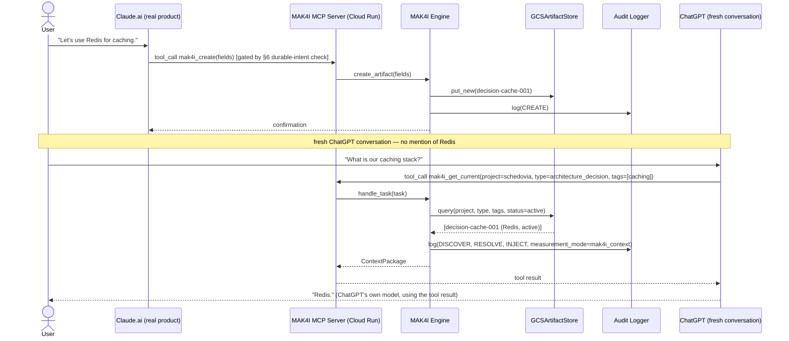
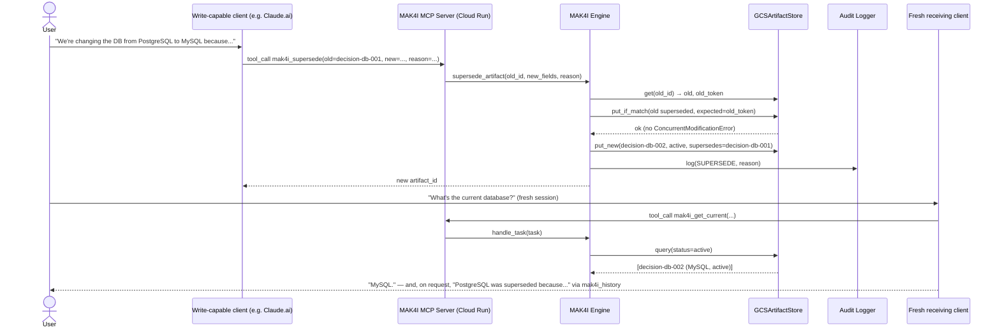
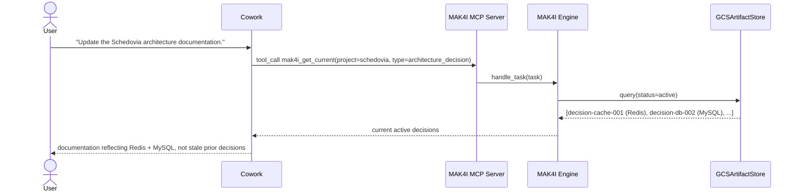
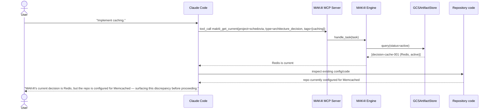
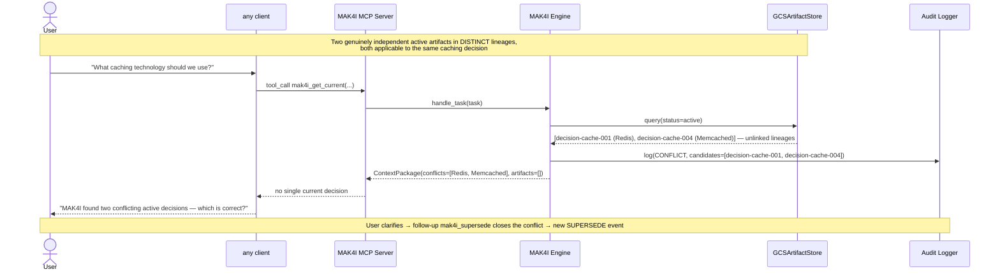

# MAK4I Reference MVP — Architecture Design (Revision 4)

Talvik, Inc. · MAK4I MVP v0.3.1 · Architecture design
Date: 2026-09-01 (Revision 3, v0.3.1 requirements); Developer Preview
multi-org authorization (Revision 4) deployed and live-accepted 2026-09-09.

## What changed from Revision 3 (Revision 4 — Developer Preview)

The Developer Preview adds multi-organization authorization on top of the
single-project MVP below — a new capability layer, not a rewrite of it.
**This explicitly supersedes §3's and §4's "project stays hardcoded to
schedovia" constraint** and §24 item 12's "nothing in this document
introduces … Cloud SQL, … or multi-tenancy" note; both were correct for
Revision 3's scope and are superseded here, per the "smallest secure
identity/authorization model" principle (never a general IAM product):

1. **New identity/control-plane layer** (`src/mak4i/identity/`): `Organization`,
   `Principal`, `Project`, `Grant`, `Credential` — a `ControlPlaneStore`
   protocol (mirroring `ArtifactStore`'s pattern) backed by `SqlControlPlaneStore`
   (SQLAlchemy 2.0 + Alembic; SQLite locally, PostgreSQL — Cloud SQL — hosted)
   or `InMemoryControlPlaneStore` (unit tests). See new §25.
2. **Credential authentication replaces the single shared bearer token.**
   Each principal gets one or more hashed, individually revocable credentials;
   `ControlPlane.authenticate()` resolves a bearer token to a `Principal`,
   never to a shared secret. §10, §21, §25.
3. **Fail-closed authorization on every engine operation.** A new `Authorizer`
   collaborator checks READ/WRITE before any artifact read or write reaches
   the store; denial is explicit (`AccessDeniedError`) and audited
   (`ACCESS_DENIED`), never an empty-success. §21, §25.
4. **`ArtifactStore` and the `Artifact` model are scoped by `(organization_id,
   project)`**, not `project` alone — the GCS/local layout moves off the
   hardcoded `schedovia/` path to `<organization_id>/<project_id>/<artifact_id>.json`.
   §3, §4.
5. **Provenance is principal-derived, not caller-supplied.** `created_by` and
   every audit `actor`/`principal_id` come from the authenticated `Principal`
   the engine resolved — never from a value a caller could pass in. §9, §25.
6. **New audit events**: `AUTHENTICATE_SUCCESS`/`AUTHENTICATE_FAILURE`,
   `ACCESS_GRANTED`/`ACCESS_DENIED`, and per-operation markers `GET_CURRENT`/
   `SEARCH`/`HISTORY`, each carrying `principal_id`/`organization_id`/
   `project_id`/`auth_method` (`"credential"` vs. the CLI-only
   `"operator_impersonation"`). §9, §25.
7. **New tool**: `mak4i_list_projects` — every project the authenticated
   principal may act on, with its permissions; projects outside its grants
   are simply absent. §10.
8. **CLI gains control-plane subcommands** (`org`, `project`, `principal`,
   `grant`, `credential`) and a trusted, CLI-only `--principal <id>`
   operator-impersonation mode, audited distinctly and never reachable from
   the hosted MCP path. §10, §25.
9. **Deployed**: Cloud SQL for PostgreSQL backs the hosted control plane;
   Cloud Run's `MAK4I_CONTROL_PLANE_DB` points at it via the Cloud SQL
   connector; the legacy `schedovia/` GCS objects were copy-migrated (never
   deleted) into the new org/project-scoped layout and validated. §25.

Everything below this point, except where a Revision 4 note says otherwise,
still describes the Revision 3 single-tenant design faithfully — it is the
foundation the Developer Preview layer sits on top of, not something it
replaced.

## What changed from Revision 2

The v0.3.1 requirements doc is a substantial rewrite, not just a storage/hosting change — this revision follows it in full:

1. **Storage → GCS.** `GCSArtifactStore` (private Google Cloud Storage bucket, JSON objects) is now the default persistent store. `LocalJSONStore` demotes to unit-test/offline-dev fixtures only — it is no longer where demo data lives.
2. **Hosting → Cloud Run.** The MCP server deploys to Google Cloud Run over Streamable HTTP/HTTPS. **The demo-time tunnel from Revision 2 is gone entirely** — this resolves that revision's biggest open flag.
3. **Concurrency redesigned around GCS.** Revision 2's file lock is replaced by GCS generation/metageneration preconditions (optimistic concurrency) — the requirements doc calls this out explicitly, since GCS has no multi-object transaction.
4. **Scope broadened and made explicitly generic.** The MVP is no longer "the database scenario" — it must handle arbitrary durable project knowledge (the worked example is now a Redis caching decision), and the core must contain zero technology-specific logic. This is now a named acceptance criterion.
5. **New: durable knowledge vs. conversation.** A discussion, hypothetical, or unaccepted option must not silently become a MAK4I artifact — this adds an explicit write-intent gate ahead of `mak4i_create`/`mak4i_supersede`.
6. **New: task-relevant retrieval.** MAK4I must not be injected into every message — retrieval is triggered when a client's model decides it's relevant, or when the user asks explicitly.
7. **Client roles clarified by the requirements doc itself**, which resolves several Revision 2 open flags: Claude.ai is now the primary decision/write surface; ChatGPT's primary demonstrated role is read/search (writes are optional, gated by account capability, not a hard requirement); Cowork gets a documentation-worker role with its own demo flow; Claude Code gets an implementation-worker role that must surface — not silently ignore — a mismatch between repo code and current MAK4I state.
8. **New demo flows A–F**, replacing Revision 2's four.
9. **New: token/context efficiency measurement** as an explicit, unclaimed-until-measured MVP objective.
10. Repository structure updated to match the requirements doc's own listing exactly.

Same tag system throughout:

| Tag | Meaning |
|---|---|
| **[PROTOCOL]** | Required regardless of implementation. |
| **[MVP CHOICE]** | This build's decision; replaceable later. |
| **[INTEGRATION-SPECIFIC]** | Belongs to one client/provider, isolated from the core. |
| **[NEEDS VERIFICATION]** | Checked against documentation, not yet against your account/project. |

---

## 0. Ground rule this design is built around

Per v0.3.1 §1: *"The implementation must not contain database-specific, caching-specific, Claude-specific, ChatGPT-specific, or other scenario-specific logic in the MAK4I core."* Every section below is written so that a Redis decision, a PostgreSQL→MySQL decision, and a documentation fact all move through the identical path:

```
Any real client → MCP (stdio or Cloud Run HTTPS) → MAK4I Engine
  → Artifact Manager / Discovery / Resolver / Context Builder / Audit
  → ArtifactStore → GCSArtifactStore → private GCS bucket
```

MCP is the integration boundary, not the protocol. GCS and Cloud Run are this MVP's implementation choices for the store and the transport host, not protocol requirements — the requirements doc says this explicitly (§15.1), and this design keeps the engine's dependency on `ArtifactStore` as the only seam that matters.

---

## 1. Component Architecture

```
  Claude.ai (web)     ChatGPT              Cowork               Claude Code
  remote MCP          remote MCP           remote MCP OR         remote MCP OR
  (decision surface)  (read consumer)      local stdio           local dev stdio
       │                    │              (doc worker)          (impl worker)
       └─────────┬──────────┴───────┬──────────┘                     │
                  │   HTTPS          │  HTTPS/stdio                   │ stdio (optional)
                  ▼                  ▼                                 ▼
       ┌─────────────────────────────────────────┐         ┌──────────────────────┐
       │   Cloud Run — MAK4I MCP Server            │◀────────│  local dev instance   │
       │   Streamable HTTP/HTTPS · app-level auth  │         │  (optional, LocalJSON  │
       │   dedicated service account + ADC         │         │   fixtures for tests)  │
       └───────────────────┬─────────────────────────┘         └──────────────────────┘
                            ▼
                 ┌───────────────────────────┐
                 │      MAK4I Engine           │  stateless, no cache
                 └───────────────┬─────────────┘
     ┌──────────────┬────────────┼────────────┬────────────────┐
     ▼              ▼            ▼            ▼                ▼
┌──────────┐ ┌───────────┐ ┌──────────┐ ┌────────────┐ ┌────────────┐
│Artifact  │ │Discovery  │ │Resolver  │ │  Context   │ │   Audit    │
│Manager   │ │           │ │          │ │  Builder   │ │  Logger    │
└────┬─────┘ └─────┬─────┘ └────┬─────┘ └────────────┘ └────────────┘
     └──────────────┴────────────┘
                    ▼
       ┌─────────────────────────────┐
       │   ArtifactStore (interface)   │
       │   → GCSArtifactStore (MVP)    │  private GCS bucket, generation preconditions
       │   → LocalJSONStore (tests)    │
       └─────────────────────────────┘
```

**[PROTOCOL]**: Artifact Manager, ArtifactStore interface, Discovery, Resolver, Context Builder, Audit Logger, the MCP tool contract — generic, technology-agnostic, transport-agnostic.

**[MVP CHOICE]**: `GCSArtifactStore` as the default persistent store, `LocalJSONStore` for tests/offline dev, the MCP server as one Cloud Run service, the specific tools/transports/auth mechanism.

**[INTEGRATION-SPECIFIC]**: nothing MAK4I ships — provider-specific behavior lives entirely in each product's own connector configuration.

---

## 2. Data Flow

**Write flow**, now gated by the durable-knowledge check (§6) before it reaches the Artifact Manager:

```
caller (any MCP client) → client's model judges intent is durable (§6) → MCP tool call
  → mak4i.api.create_artifact(fields) / supersede_artifact(old_id, new_fields, reason)
  → Artifact Manager validates against MAK-0001-aligned schema
  → ArtifactStore.put_new(...) / put_if_match(...)  — see §5 for the GCS-specific sequence
  → Audit Logger.log(CREATE / SUPERSEDE / SUPERSEDE_REJECTED)
```

**Read flow**, now explicitly task-triggered rather than blanket (§8):

```
caller submits a task in its own chat UI
  → the client's own model judges MAK4I is relevant (or the user explicitly asks) — §8
    → Discovery.find_candidates(project="schedovia", ...) → ArtifactStore.query(...)
    → Resolver.resolve(candidates) → applicability, conflict/integrity check (§5), active-preference
    → Context Builder returns the smallest useful set — current artifacts only, unless the
      task asks for history/rationale/migration comparison (§8)
    → returned as the MCP tool result; the calling product's own model uses it
  → Audit Logger.log(DISCOVER, RESOLVE, INJECT) with a correlation_id and a measurement_mode tag (§19)
```

Cross-client visibility mechanism is unchanged from Revision 2 in principle — no caching anywhere in this path — but the shared state is now a GCS bucket, not a local directory; see §17.

---

## 3. MAK4I Artifact Model — generic, technology-agnostic

**[PROTOCOL]**, taken directly from the v0.3.1 minimal example — note this one is a caching decision, not a database decision, which is itself part of the requirement (§0, §6 doc): the model must not read as database-shaped.

```json
{
  "artifact_id": "decision-cache-001",
  "artifact_type": "architecture_decision",
  "project": "schedovia",
  "title": "Application caching technology",
  "content": "Use Redis for application caching.",
  "rationale": "Selected for fast shared caching and established client support.",
  "status": "active",
  "version": "1.0",
  "created_by": "claude.ai",
  "created_at": "2026-09-01T15:00:00Z",
  "updated_at": "2026-09-01T15:00:00Z",
  "lineage_id": "decision-cache-001",
  "supersedes": null,
  "superseded_by": null,
  "tags": ["caching", "redis", "architecture"]
}
```

`lineage_id`, `superseded_by`, `updated_at` — approved in Revision 2 — are now part of the requirements doc's own minimal example, so they've moved from "MVP CHOICE, approved" to effectively **[PROTOCOL]** for this MVP: the doc specifies them directly.

**[PROTOCOL, new acceptance criterion]**: *"The MAK4I core contains no Redis/PostgreSQL/MySQL-specific workflow logic."* Concretely, this means: no `if artifact_type == "database_decision"` branches, no field named after a technology, no discovery/resolution rule that only fires for a particular `tags` value. A Redis artifact, a PostgreSQL/MySQL artifact, and a plain documentation-fact artifact must all pass through identical Discovery/Resolver/Context Builder code — tested directly (§22: "a Redis caching artifact and a PostgreSQL/MySQL database artifact must exercise the same generic code paths").

Project stays hardcoded/defaulted to `schedovia`, unchanged from Revision 2.

**Revision 4 (Developer Preview) note**: the artifact model gains one field,
`organization_id` — the opaque id of the owning organization, resolved by
the engine from the authenticated principal's grant, never supplied by the
caller. `project` keeps its name but now holds an opaque `project_id`
rather than the literal string `"schedovia"` — the hardcoding above is
superseded. See §25.

---

## 4. Artifact Storage Abstraction — GCS-backed

**[PROTOCOL]** interface — redesigned from Revision 2's `put()`/`lock()` shape to one that maps cleanly onto GCS's native optimistic concurrency, since the requirements doc is explicit that the engine must depend on `ArtifactStore`, never directly on GCS APIs:

```python
class ArtifactStore(Protocol):
    def get(self, artifact_id: str) -> tuple[Artifact, str] | None:
        """Returns (artifact, version_token). version_token is opaque —
        a GCS object `generation` number for GCSArtifactStore, a content
        hash/mtime for LocalJSONStore."""
        ...

    def put_new(self, artifact: Artifact) -> None:
        """Create-if-absent. Raises ArtifactAlreadyExistsError on collision."""
        ...

    def put_if_match(self, artifact: Artifact, expected_version_token: str) -> None:
        """Conditional update. Raises ConcurrentModificationError if the
        object changed since `expected_version_token` was read."""
        ...

    def query(self, project: str, artifact_type: str | None = None,
              tags: list[str] | None = None,
              status: str | None = "active") -> list[Artifact]: ...

    def all(self, project: str | None = None) -> list[Artifact]: ...
```

**[MVP CHOICE]** `GCSArtifactStore` (default, persistent): one JSON object per artifact at `gs://<bucket>/schedovia/<artifact_id>.json` in a **private** bucket. `put_new` uses GCS's `ifGenerationMatch=0` precondition (create-only-if-absent). `put_if_match` uses `ifGenerationMatch=<generation>` (update-only-if-unchanged-since-read) — this *is* the concurrency control the requirements doc asks for; no separate lock file is needed against GCS, because the precondition check happens atomically on GCS's side.

**[MVP CHOICE]** `LocalJSONStore` (tests/offline dev only): same interface, implemented with a local file lock plus a version stamp (e.g. a monotonically bumped token) to emulate the same conditional-write contract for unit tests that shouldn't need real GCS credentials. **This store no longer holds demo data** — `artifacts/schedovia/` in the repo is fixtures for tests, not the source of truth (§22).

Nothing outside `store/` knows which backend is in use. Discovery, Resolver, Context Builder, and the MCP server only ever see `Artifact` objects and version tokens through this interface.

**Revision 4 (Developer Preview) note**: every method above is now scoped
by `(organization_id, project)`, not `project` alone —
`get(organization_id, project, artifact_id)`, `query(organization_id,
project, ...)`, plus a new `query_many(scopes, ...)` for authorized
cross-project search and `all(organization_id=None, project=None)` for the
resolver/operator tooling. `GCSArtifactStore`'s layout is
`gs://<bucket>/<organization_id>/<project_id>/<artifact_id>.json`;
`LocalJSONStore` nests the same way on disk. See §25.

---

## 5. Versioning & Supersession — GCS concurrency model

**[PROTOCOL]** invariants unchanged: supersession is always explicit, history is never deleted, the resolver never selects a superseded artifact as current, and — restated in the requirements doc's own words — **"on an integrity error, resolution must fail closed for that lineage rather than guess."**

**What GCS changes, stated the way the requirements doc states it**: *"GCS object writes do not provide a multi-object transaction for the supersession sequence."* The two-object write in a supersede is exactly as non-atomic on GCS as it was on local disk in Revision 2 — the difference is that GCS gives a real, native tool (generation preconditions) for the *concurrency* half of the problem, which Revision 2 had to fake with a file lock.

**Corrected write sequence for `supersede_artifact(old_id, new_fields, reason)`:**

1. `old, old_token = store.get(old_id)`.
2. Confirm `old.status == "active"`. If not, **reject** (`ArtifactNotActiveError`) — log `SUPERSEDE_REJECTED`, stop; nothing is written.
3. Build `new` (version = `old.version + 1`, `lineage_id = old.lineage_id`, `supersedes = old_id`, `status = active`).
4. `store.put_if_match(old_updated, expected_version_token=old_token)` — writes `old` with `status → superseded`, `superseded_by → new_id`. **If this raises `ConcurrentModificationError`** — someone else wrote `old` since step 1 — reject the whole operation right here, log `SUPERSEDE_REJECTED`, and do **not** proceed to step 5. This is the GCS-native version of the race-closing check Revision 2 did with a file lock.
5. `store.put_new(new)` — creates the new object. If this raises `ArtifactAlreadyExistsError` (id collision), reject/regenerate.
6. Log `SUPERSEDE` only once both writes succeed.

**Honest failure mode, unchanged in spirit from Revision 2**: a crash between steps 4 and 5 leaves the lineage with **zero active members** (old superseded, new never created). Old-first ordering is kept for the same reason as before — "no current decision" is a safer, more legible failure than "two decisions both look current," which is the shape of a genuine conflict (§18) and shouldn't be produced by an accident.

**Integrity validation, restated to match the requirements doc's "fail closed" language**: `mak4i.api.check_integrity(project)` groups artifacts by `lineage_id` and flags zero-active, multiple-active, and dangling `supersedes`/`superseded_by` pointers — exactly as in Revision 2. What's new is the explicit requirement that Resolution **fail closed**: on any integrity anomaly for a lineage, that lineage contributes nothing to the resolved result and the anomaly is reported, rather than resolution guessing which candidate is "probably" current.

```
decision-db-001 · v1.0   PostgreSQL   superseded → superseded_by: decision-db-002
decision-db-002 · v2.0   MySQL        active     → supersedes:    decision-db-001
```

---

## 6. Durable Knowledge vs. Conversation (new)

**[PROTOCOL]**, new in v0.3.1 §3: a question, suggestion, hypothetical, or unaccepted option must not automatically become an authoritative MAK4I artifact.

| Utterance | Treatment |
|---|---|
| "Could we use Redis?" | Discussion — no artifact. |
| "Redis is one option." | Candidate information — no artifact, or at most a non-current note; not marked active. |
| "Let's use Redis for caching." | Durable decision candidate — create/update. |
| "Replace Redis with Valkey." | Durable change — supersede, preserve history. |

**Design implication**: this is not something the MAK4I engine can judge from the artifact payload alone — by the time `mak4i_create`/`mak4i_supersede` is called with a fully-formed artifact, the intent decision has already been made by *something*. Per the requirements doc, that something is the calling client's own model, guided by the MCP tool descriptions: **[MVP CHOICE]** the `mak4i_create` and `mak4i_supersede` tool descriptions carry explicit guidance — *"Call this only when the user's message establishes or changes a durable project decision, not for hypotheticals, options, or open questions. If intent is ambiguous, ask the user to confirm before calling this tool."* This mirrors §7's "MAK4I can present clearly but cannot force the calling model's behavior" limitation: the gate is advisory at the protocol boundary and enforced by prompting, not by code that can inspect intent. It is not nothing, though — `created_by`/`rationale` on every artifact plus the audit trail make it possible to catch a wrongly-created artifact after the fact and correct it via an explicit supersede or (operator-only) deletion path, which is the realistic MVP-scale backstop for an occasional bad call.

---

## 7. Discovery & Resolution Flow

Mechanism unchanged from Revision 2 (§6 there): applicability → group by `lineage_id` → integrity check (fail closed, §5) → cross-lineage conflict check (§18) → resolved/conflict/integrity-error outcome, every step captured in a `resolution_trace`.

**[MVP CHOICE — flagged, §24]**: the cross-lineage conflict-grouping rule (same `artifact_type` + tag overlap, no lineage link) is still this design's own reading — the full MAK-0004 text has never been available across any revision.

---

## 8. Context Injection — task-relevant, not blanket (new emphasis)

**[PROTOCOL]**, new in v0.3.1 §8: *"MAK4I must not inject the entire project on every user message."* The normal flow is client-triggered:

```
User Task → client decides MAK4I is relevant → Search/Discover → Resolve → Compact Context Result → Client Model → Response/Action
```

Two trigger paths, both legitimate:
- **Implicit** — the client's own model judges a message needs project knowledge and calls `mak4i_search`/`mak4i_get_current` on its own initiative. MAK4I has no control over this judgment (§7 in Revision 2 — unchanged: MAK4I can't force a tool call).
- **Explicit** — the user asks directly ("Check MAK4I and tell me our current caching architecture"), which should reliably trigger a call given reasonable tool descriptions, since it names the tool's purpose directly.

**[PROTOCOL]**: the returned result should be **the smallest useful set of current applicable artifacts** — not the whole project. Historical/superseded artifacts are returned only when the task itself asks for history, migration, rationale, or comparison; `mak4i_get_current` returns only current artifacts by default, while `mak4i_history` is the explicit tool for lineage/rationale queries. This keeps the two concerns (what's current vs. what happened) as separate tool calls rather than one tool that always returns everything, which is also what keeps §19's token measurement meaningful — a result that's already "the whole project" every time would make the comparison pointless.

The `ContextPackage`/tool-result shape from Revision 2 is unchanged (`artifacts`, `conflicts`, `integrity_errors`, `instruction`, `resolution_trace_id`); what's new here is the retrieval trigger discipline, not the payload shape.

---

## 9. Audit / Provenance Model

Event types unchanged from Revision 2 (`CREATE`, `SUPERSEDE`, `SUPERSEDE_REJECTED`, `DISCOVER`, `RESOLVE`, `CONFLICT`, `INTEGRITY_ERROR`, `INJECT`, `RESPONSE`), with fields added for §19:

```json
{"ts": "...", "event": "INJECT", "correlation_id": "...", "actor": "chatgpt",
 "artifact_ids": ["decision-cache-001"], "context_result_bytes": 412,
 "context_tokens_estimate": 103, "measurement_mode": "mak4i_context",
 "client_exposed_token_count": null}
```

`client_exposed_token_count` is populated only when the calling client's own interface surfaces a real token count (most don't, mid-conversation); otherwise the heuristic estimate is what's recorded, and the audit entry says which one it is — never silently presenting an estimate as a measured number.

---

## 10. API / Tool Interface — MCP on Cloud Run

**[PROTOCOL]**: one MAK4I Engine, callable identically by tests, the CLI, and the MCP server — the requirements doc is explicit that "the internal engine should remain callable by tests/CLI without MCP so later REST, SDK, CLI, or other transports can reuse the same behavior."

**[MVP CHOICE]**, per v0.3.1 §15/§15.1: the MCP server (`src/mak4i/mcp_server.py`) deploys as a single **Cloud Run** service, Streamable HTTP over HTTPS. This replaces Revision 2's demo-time ngrok tunnel entirely — Cloud Run gives a stable HTTPS URL for the life of the deployment, not just the life of a demo session.

**Hosting details:**
- **Container**: the MCP server packaged as a container image, deployed with `gcloud run deploy`.
- **Service account**: a dedicated runtime service account (e.g. `<service>-runtime@<project>.iam.gserviceaccount.com`) scoped to only the permissions needed on the one artifact bucket (object read/write, not project-wide storage admin). The container host attaches this automatically; the GCS client library picks up Application Default Credentials from the running container with **no key file ever committed** — this satisfies the requirements doc's explicit prohibition on committing long-lived service-account keys.
- **Bucket privacy vs. endpoint reachability — two different protections, both required:**
  - The **GCS bucket** stays fully private — no public ACL, reachable only by the Cloud Run service's own identity. This is what the requirements doc means by "must not make the artifact bucket public."
  - The **Cloud Run endpoint** must still be reachable over the open internet for ChatGPT/Claude.ai/Cowork's cloud infrastructure to call it at all — external SaaS connectors can't present a Google-signed identity token the way another GCP service could, so Cloud Run's own IAM-invoker auth doesn't map cleanly onto them. **[MVP CHOICE]**: Cloud Run ingress is set to allow unauthenticated HTTP, and authorization is enforced *inside* `mcp_server.py` itself — a bearer token (or OAuth, if a specific platform's connector setup requires it — see §24) checked on every request. This satisfies "authentication must be configured before exposing project knowledge to cloud-hosted AI clients" without requiring the bucket or the data to ever be reachable except through that one authenticated application layer.
- **Streaming**: Streamable HTTP needs long-lived request handling; confirm Cloud Run's current timeout/concurrency settings match what MCP clients expect at deploy time — **[NEEDS VERIFICATION]**, implementation-time check, not architecturally blocking.

Tools exposed, unchanged from Revision 2: `mak4i_search`, `mak4i_get_current`, `mak4i_create`, `mak4i_supersede`, `mak4i_history` — now each carrying the durable-vs-conversation guidance from §6 in its description. `check_integrity` stays CLI-only (`mak4i doctor`), not model-callable.

**Local path, still available**: per the requirements doc, "Claude Code may connect to the same remote endpoint or use a local development path where useful." A local stdio MCP server still talks to the *same* GCS bucket via the developer's own `gcloud auth application-default login` credentials — it is not a separate data store. The only thing that's truly local-only is `LocalJSONStore`, and that's fixtures/tests, never demo data (§4).

**Revision 4 (Developer Preview) note**: the single shared bearer token
above is superseded by per-principal credential authentication (§25) — a
sixth tool, `mak4i_list_projects`, is added; every other tool keeps its
name and durable-vs-conversation guidance but now requires an explicit
`project` argument (no more implicit default) and is authorized against
the caller's resolved `Principal`, never a free-text `actor`/`created_by`
argument. The stdio path authenticates one credential once at process
startup (`MAK4I_TOKEN`) rather than per call, since a local stdio session
is single-user for its whole lifetime.

---

## 11. Client Roles Overview

Directly from the requirements doc §10, since it now specifies this rather than leaving it open (this resolves several Revision 2 flags):

| Client | Primary MVP role | Expected MAK4I use |
|---|---|---|
| **Claude.ai** | Decision/discussion surface | Create, update/supersede, read, history where supported |
| **ChatGPT** | Independent cross-provider consumer | Read/search/history primarily; writes optional if the account integration supports them |
| **Cowork** | Documentation worker | Read current knowledge; create/update project documentation accordingly |
| **Claude Code** | Implementation worker | Read current decisions before architecture-sensitive coding; write durable implementation/project state when appropriate |
| GitHub Copilot / Gemini / DeepSeek | Optional stretch interoperability | Validation only — must not require MAK4I core changes (§16) |

A client's inability to do something is now explicitly required to be documented as **that client's** limitation, never MAK4I's (§22 acceptance criteria) — this is exactly the discipline the `NEEDS VERIFICATION` tag has been enforcing since Revision 2, now backed by the requirements doc itself.

---

## 12. Claude.ai Integration Approach

**[INTEGRATION-SPECIFIC]**. Now the demo's primary **write** surface, not ChatGPT — this softens Revision 2's biggest open risk (ChatGPT's plan-tier gating on write-capable custom MCP tools no longer sits on the critical path of the core demo). Connected as a custom connector (**Customize → Connectors → Add custom connector**) pointed at the Cloud Run HTTPS endpoint. Custom connectors are available on Free/Pro/Max/Team/Enterprise, per Revision 2's research — no plan-tier risk here.

This performs Demo Flow A/B's write side: "Let's use Redis for caching" / "change PostgreSQL to MySQL" spoken in the real Claude.ai app, gated by §6, resulting in a real `mak4i_create`/`mak4i_supersede` call against the live Cloud Run service.

---

## 13. ChatGPT Integration Approach

**[INTEGRATION-SPECIFIC]**. Primary role is now **read/search/history** (§11) — the requirements doc explicitly makes ChatGPT's write capability optional and gated by account integration ("writes are optional if the account integration supports them"), which matches Revision 2's finding that write-capable custom MCP tools may require a Business/Enterprise/Edu plan. Setup: **Settings → Apps → Create**, pointed at the same Cloud Run endpoint.

This performs Demo Flow A's read side: a fresh ChatGPT conversation, no mention of Redis, asks "What is our caching stack?" and must retrieve the Claude.ai-created artifact through MAK4I.

**[NEEDS VERIFICATION]**, unchanged from Revision 2: whether this account's plan supports even the read-only Apps SDK connector path reliably for this use case — the read side is much less plan-gated than the write side per OpenAI's own Help Center, but confirm before a live run.

---

## 14. Cowork Integration Approach

**[INTEGRATION-SPECIFIC]**. Documentation-worker role (§11, new in v0.3.1) — Demo Flow C. Cowork reads current MAK4I knowledge and creates/updates Schedovia's technical/architecture documentation from it; after a decision changes, a later documentation update must reflect the new current artifact, not stale knowledge it happened to have from an earlier pass.

Two connection shapes, as in Revision 2 — unchanged: **colocated** (same workspace/filesystem as the MAK4I repo, direct API/CLI or local stdio, no network dependency) or **independent remote peer** (custom connector against the Cloud Run endpoint, same as Claude.ai/ChatGPT). Since Cloud Run now means there's no tunnel to avoid, the remote path is no heavier than it is for any other client — colocated remains the cheaper option mainly because it skips connector setup entirely, not because it avoids new infrastructure.

**[NEEDS VERIFICATION]**, unchanged from Revision 2: Cowork's connector mechanism and plan gating were inferred from third-party documentation, not confirmed first-party.

---

## 15. Claude Code Integration Approach

**[INTEGRATION-SPECIFIC]**. Implementation-worker role (§11) — Demo Flow D, with a requirement new in v0.3.1: *"If repository code disagrees with MAK4I current state, it should surface the discrepancy/migration need rather than silently use stale architecture."*

**Design implication**: `CLAUDE.md` should instruct Claude Code not just to call `mak4i_get_current` before architecture-sensitive work (unchanged from Revision 2), but to actively compare what it finds in the repository (a connection string, an ORM dialect, a config value) against the current MAK4I artifact, and to say so explicitly — in its own output, not silently — when they disagree, rather than assuming the repo is authoritative or silently trusting MAK4I over visible code. This is a behavioral instruction, same category as the rest of `CLAUDE.md`'s MAK4I guidance — no artifact content is hard-coded, only the rule to check and to speak up on mismatch.

Connects via `claude mcp add` to either the Cloud Run endpoint or a local stdio server — the requirements doc leaves this open ("may connect to the same remote endpoint or use a local development path where useful"), and this design doesn't force a choice between them.

---

## 16. Optional Stretch Clients — GitHub Copilot / Gemini / DeepSeek

**[INTEGRATION-SPECIFIC], explicitly out of core scope.** The requirements doc lists these as optional stretch interoperability validation — *"must not require MAK4I core changes."* If attempted, each would connect the same way ChatGPT does: a remote MCP/tool-calling connector against the same Cloud Run endpoint, using whatever tool-calling mechanism that product supports. None of this is designed further here, since the requirements doc doesn't ask for it beyond noting it must not force core changes — and nothing in this architecture's core (§0's technology- and provider-neutral boundary) would need to change to add one.

---

## 17. Cross-Client Visibility

Mechanism unchanged in principle from Revision 2 — restated for GCS/Cloud Run:

1. Every client — Claude.ai, ChatGPT, Cowork over Cloud Run's HTTPS endpoint, Claude Code either way — calls the same MAK4I Engine against the same private GCS bucket.
2. No layer caches. The Cloud Run service holds no state between requests (Cloud Run instances are ephemeral and may be recycled between calls regardless); Discovery/Resolver re-read the bucket on every call via `ArtifactStore.query()`/`get()`.
3. `supersede_artifact()` (§5) writes both objects, precondition-protected, before returning success.
4. The moment a write-capable client's `mak4i_supersede` call returns, the very next `mak4i_get_current` call from any other client — regardless of which machine or account it runs on — sees the new artifact as current. This is now proven across a genuine multi-tenant-adjacent cloud boundary (Cloud Run + GCS), not just a demo-time tunnel.

**Protocol-adjacent invariant, unchanged**: no component in this path may cache a resolved artifact across calls, including the Cloud Run service process itself.

---

## 18. Conflict Handling — policy unchanged, restated against "fail closed"

**[PROTOCOL]**: never auto-select between genuinely conflicting active artifacts; surface, require clarification, record the resolution — locked in Revision 2, unchanged here, now explicitly distinguished in the requirements doc's own acceptance criteria from an integrity error: *"Integrity errors within a lineage are distinguishable from genuine cross-lineage conflicts and fail closed."* Both fail closed in the sense of never guessing, but they mean different things and are logged as different event types (`CONFLICT` vs. `INTEGRITY_ERROR`, §5/§9) — a conflict is two legitimate decisions disagreeing; an integrity error is the store contradicting its own invariants.

Demo Flow E: create two genuinely conflicting active artifacts in **distinct lineages** (not a supersession pair); any client's read must surface the conflict and require clarification; the eventual resolution (typically a follow-up supersede) is itself logged.

---

## 19. Token / Context Efficiency Measurement (new)

**[PROTOCOL, new in v0.3.1 §13]**: token efficiency is a **measurement objective**, not a pre-claimed benefit. *"Do not claim a fixed token-saving percentage until measured."*

**What MAK4I can measure directly**: every `INJECT` audit event already records `context_result_bytes` and a token estimate (§9) — this is the "MAK4I-selected context" condition, condition (3) below, and it's automatic, requiring no extra operator effort.

**What MAK4I cannot measure directly, and why**: conditions (1) and (2) below happen *without* MAK4I in the loop by definition — a fresh client with no project context, or a client fed manually-pasted project context, never calls a MAK4I tool, so there's no audit event to record. These are necessarily **operator-run, manually-recorded** comparisons.

**[MVP CHOICE]**: `docs/TOKEN_MEASUREMENT.md` is a template/log, not a component — for each selected task, the operator runs and records:

| Condition | What's recorded |
|---|---|
| (1) Fresh client, no project context | User prompt size, response size, correctness (did it guess right / ask / get it wrong) |
| (2) Manual/repeated project context sufficient for the task | User prompt size including pasted context, response size, correctness |
| (3) MAK4I-selected context | Same fields, but `context_result_bytes`/token estimate come from the audit log automatically (§9), tagged `measurement_mode: mak4i_context` |

A results table across a handful of representative tasks (the caching decision, the database decision, a documentation-generation task) is the actual MVP deliverable here — not a single claimed percentage. This keeps the measurement honest to what the requirements doc asks for: a comparison, not a marketing number.

---

## 20. Technology- and Provider-Neutral Core

Broadened from Revision 2's "provider-neutral boundaries" to explicitly include the technology-neutral requirement (§3, §22):

- `models/`, `store/`, `discovery/`, `resolution/`, `context/`, `audit/` import no provider SDK and contain no technology-named branches — testable with a Redis artifact and a MySQL artifact through the identical code path, and this is now a named test requirement, not just a design aspiration.
- The MCP tool contract (names, inputs, result shape) is identical regardless of client — same as Revision 2.
- `ContextPackage`/tool-result shape is the one intermediate representation every client's tool result is built from.

---

## 21. Security Considerations (MVP-appropriate, Cloud Run/GCS-specific)

- **Bucket privacy is the primary boundary now**, not a tunnel's obscurity (Revision 2's biggest weakness) — no public ACL on the GCS bucket, ever; access only through the Cloud Run service's dedicated service account.
- **No committed credentials.** ADC via the attached service account, no service-account key files in the repository — a hard requirement from v0.3.1 §15.1, not just a recommendation.
- **Least-privilege service account** — scoped to object read/write on the one artifact bucket, not project-wide Storage Admin.
- **Application-level auth on the Cloud Run endpoint** (§10) — a bearer token (or OAuth where a platform requires it) checked inside `mcp_server.py`, independent of Cloud Run's own IAM-invoker layer, since Cloud Run ingress must allow unauthenticated HTTP for external connectors to reach it at all.
- **No privileged write path** — an MCP-originated call goes through identical Artifact Manager validation as a CLI-originated one, unchanged from Revision 2.
- **Concurrency safety is now GCS-native** (§5) rather than a local lock — a genuine improvement, since it holds correctly across multiple Cloud Run instances, which a single-process file lock never could have.
- **Treat artifact content as data, not instructions**, unchanged concern from Revision 2, when a tool result is read by a model whose prompting you don't control.
- **Watch the Cloud Run service's logs** (Cloud Logging) during a demo run as the authoritative record of what was actually called — more durable than relying on a chat transcript alone.

**Revision 4 (Developer Preview) additions**:
- **Per-principal credential authentication** (§25) replaces the single
  shared bearer token above — each credential is individually revocable,
  and only its SHA-256 hash is ever stored; the raw token exists in
  plaintext only once, at issuance, and is never logged.
- **Fail-closed authorization on every read and write** — no
  `authorizer=None` bypass in any deployed wiring; a principal with no
  grant on a project is denied identically whether the project doesn't
  exist or simply isn't theirs, so denial is never a metadata oracle.
- **Least-privilege on the new Cloud SQL control-plane database**, same
  posture as the GCS bucket: a dedicated database user scoped to the one
  `mak4i` database, connected only via the Cloud SQL Auth Proxy/connector
  (no public-IP authorized-network exposure), with its connection string
  held in Secret Manager and never committed.

---

## 22. Repository Structure

Matches the requirements doc's own listing exactly (§16):

```
mak4i-reference/
  README.md
  CLAUDE.md
  pyproject.toml
  src/mak4i/
    models/
    store/
      base.py                      # ArtifactStore interface
      local_json.py                # tests/offline dev only
      gcs.py                       # default MVP persistent store
    discovery/
    resolution/
    context/
    audit/
    identity/                      # Revision 4 — control plane (org/principal/project/grant/credential)
    api.py                         # Engine — the one library surface
    mcp_server.py                  # stdio (local/dev) + Streamable HTTP (hosted)
    cli.py                         # includes `mak4i doctor` + control-plane subcommands
  artifacts/
    schedovia/                     # local test fixtures only — not demo data
    examples/
  migrations/                      # Revision 4 — Alembic, control-plane schema
  scripts/
    seed_dev_preview.py            # Revision 4 — seeds the multi-org acceptance fixture
    migrate_gcs_layout.py          # Revision 4 — copy-and-validate object-store layout migration
  tests/
  Dockerfile                       # container build for the MCP server
  docs/
    MVP_ARCHITECTURE.md
    DEPLOYMENT.md                  # deployment contract (was deploy/cloudrun/service.md)
    LOCAL_SETUP.md                 # local + self-hosting guide
    DEMO.md
    TOKEN_MEASUREMENT.md           # new — §19
    LATENCY_BENCHMARK.md
```

---

## 23. Demo Flows & Sequence Diagrams

### Flow A — Cross-AI creation / retrieval (Claude.ai → ChatGPT)



### Flow B — Cross-AI evolution (write-capable client → fresh reader)



### Flow C — Documentation (Cowork)



### Flow D — Implementation (Claude Code, discrepancy surfaced)



### Flow E — Conflict



**Flow F — Control/efficiency** is not a system sequence; it's the operator-run measurement methodology in §19.

---

## 24. Assumptions & Open Architecture Decisions

**Still the biggest gap, unchanged across all three revisions**: the full MAK-0001/0003/0004/0005 specifications have never been provided.

| # | Item | Status |
|---|---|---|
| 1 | Storage = GCS, hosting = Cloud Run | **Decided** by you and the requirements doc — §4, §10. |
| 2 | Tunnel-based deployment (Revision 2) | **Superseded** — Cloud Run replaces it entirely. |
| 3 | Concurrency model | **Redesigned** around GCS generation/metageneration preconditions — §5. |
| 4 | Core must be fully technology-agnostic | **Locked** by the requirements doc — §3, §20, tested directly. |
| 5 | Durable-knowledge-vs-conversation gate | **New protocol requirement** — enforced via tool-description guidance, not code that inspects intent (§6); this is inherently advisory at the MCP boundary, same limitation as §8's retrieval-trigger discipline. |
| 6 | ChatGPT write-capability plan-tier gating | **De-risked, not resolved** — the requirements doc now makes ChatGPT's write role optional, so this no longer blocks the core demo, but the underlying **[NEEDS VERIFICATION]** from Revision 2 still applies if you do want ChatGPT to write. |
| 7 | Cloud Run endpoint auth mechanism (bearer token vs. OAuth) | **Proposed, not confirmed** — §10, §21; confirm against each connector platform's actual setup flow at implementation time. |
| 8 | Cloud Run Streamable HTTP timeout/concurrency settings | **[NEEDS VERIFICATION]** at deploy time — §10. |
| 9 | Cowork's connector mechanism and plan gating | **[NEEDS VERIFICATION]**, unchanged from Revision 2 — §14. |
| 10 | GCP project, region, bucket naming | Open, low-stakes — pick at implementation time. |
| 11 | Whether a clarified conflict must always end in a supersede, or two artifacts can coexist at narrower scope | **Open question**, unchanged since Revision 1. |
| 12 | Conflict-grouping rule (same type + tag overlap, no lineage link) | Assumption, unchanged since Revision 1 — validate against the real MAK-0004 spec if one exists. |

Nothing **in Revision 3's scope above** introduced a vector database, Cloud SQL, Firestore, a production registry, or multi-tenancy — all explicitly out of scope in v0.3.1 §4 and §15, and none were needed to satisfy anything through §23. **Revision 4 (Developer Preview) supersedes this one item deliberately** — see the changelog at the top of this document and §25: multi-organization authorization is a separately-scoped, explicitly-requested capability layer, not a reversal of the "avoid multi-tenancy unless proven necessary" principle, which the Developer Preview still honors via the "smallest secure identity/authorization model" constraint (no OAuth/OIDC/SSO/SCIM, no RBAC hierarchy, no billing).

---

## 25. Identity, Authorization & Deployment Model (Revision 4 — Developer Preview)

Adds the "who is calling, what can they touch, and where is that recorded"
layer the single-project MVP above didn't need. Nothing in §1–§24 is
rewritten by this section — the artifact model, resolver, discovery, and
context builder are unchanged; this section describes what now sits in
front of them.

### 25.1 Domain model

Five frozen, generic entities in `src/mak4i/identity/models.py` — no
sample-org/project name ever appears in this layer's own code, only in
seed scripts, fixtures, and tests:

| Entity | Fields | Notes |
|---|---|---|
| `Organization` | `organization_id, name, status, created_at, updated_at` | `status`: `active` \| `suspended` |
| `Principal` | `principal_id, organization_id, type, role, display_name, status, created_at, updated_at` | `type`: `human`\|`service`\|`agent`; `role`: `owner`\|`member` — governs **control-plane administration only**, never artifact access directly |
| `Project` | `project_id, organization_id, name, status, created_at, updated_at` | Replaces the single hardcoded `schedovia` project — an organization may hold any number |
| `Grant` | `grant_id, principal_id, project_id, permissions, created_at` | `permissions`: subset of `{read, write}`; a principal with no grant on a project is denied — org membership alone confers nothing |
| `Credential` | `credential_id, principal_id, token_hash, status, display_name, created_at, expires_at?, revoked_at?` | Only a SHA-256 hash is stored; the raw token is returned once, at issuance, and never again |

All ids are opaque, prefixed UUIDs (`org_…`, `prn_…`, `prj_…`, `grt_…`,
`cred_…`) — nothing parses the prefix; it exists purely for log/CLI
readability, and guarantees a same-named project in two different
organizations never collides.

### 25.2 Control plane persistence

`ControlPlaneStore` (protocol, `identity/store.py`) mirrors `ArtifactStore`'s
own pattern exactly: pure storage, no business rules. Two implementations:

- `InMemoryControlPlaneStore` — unit tests.
- `SqlControlPlaneStore` — SQLAlchemy 2.0 Core over one URL, no dialect
  branching in business logic: **SQLite locally** (`MAK4I_CONTROL_PLANE_DB`
  unset defaults to `sqlite:///./mak4i-control-plane.db`, or
  `MAK4I_CONTROL_PLANE_CREATE_TABLES=1` for a throwaway test database built
  directly from `identity/schema.py`'s metadata) and **PostgreSQL — Cloud
  SQL — hosted** (`MAK4I_CONTROL_PLANE_DB=postgresql+psycopg://…`, schema
  applied once via `alembic upgrade head` against `migrations/versions/
  0001_initial_control_plane.py`, never `create_tables`).

All business rules — owner-role gating on administration, the last-active-
owner guard, credential usability (active/not-revoked/not-expired),
grant→permission resolution — live in `ControlPlane` (`identity/
control_plane.py`), never in the store, the same separation `Resolver` vs.
`ArtifactStore` already established.

### 25.3 Authorization

`Authorizer` (`identity/authz.py`) is the single fail-closed gate every
engine operation passes through: it asks `ControlPlane.effective_permissions`
for the principal's permissions on the requested project and either returns
an `AuthorizationOutcome` (logging `ACCESS_GRANTED`) or raises
`AccessDeniedError` (logging `ACCESS_DENIED`) — never distinguishing "no
such project" from "no grant" on that project, so an unauthorized caller
learns nothing about projects outside its own grants. There is no
`authorizer=None` bypass in any deployed wiring.

### 25.4 Authentication

`ControlPlane.authenticate(raw_token)` resolves a bearer token to a
`Principal` via a SHA-256 hash lookup, checking credential status,
expiry, principal status, and organization status — all four collapse to
one uniform `CredentialInvalidError` externally (an internal `reason` field
carries the specific cause for audit only, never surfaced to the caller,
so the error is not an existence/state oracle).

Two call sites, both audited (`AUTHENTICATE_SUCCESS`/`AUTHENTICATE_FAILURE`):
- **Streamable HTTP** (`mcp_server._CredentialAuthMiddleware`): authenticates
  the `Authorization: Bearer <token>` header on every request except
  `/health`, then sets a `current_principal` ContextVar scoped to that one
  request.
- **stdio**: authenticates `MAK4I_TOKEN` once at process startup — a local
  stdio session is single-user for its whole lifetime, so there is no
  per-call header to check.

The operator CLI's `--principal <id>` flag is a deliberate third path,
**never wired into `mcp_server.py`**: it resolves a principal by id
directly from the control plane, without a credential, for trusted
local/operator use only — audited as `auth_method: "operator_impersonation"`,
never confused with `"credential"` in the trail.

### 25.5 Engine, store, and audit changes

- `MAK4IEngine` takes an authenticated `Principal` on every call (never a
  free-text `actor`/`created_by`) plus an injected `Authorizer`/
  `ControlPlane`; `created_by` and audit `actor` are always
  `principal.principal_id` — a caller-supplied value has no field to occupy.
- `ArtifactStore` and `Artifact` are scoped by `(organization_id, project)`
  (§3, §4); `search_authorized(principal, project=None, …)` with no
  `project` searches every project the principal holds READ on and merges
  results — projects it cannot see contribute nothing and are never named.
- New audit events (§9): `AUTHENTICATE_SUCCESS`/`AUTHENTICATE_FAILURE`,
  `ACCESS_GRANTED`/`ACCESS_DENIED`, and read markers `GET_CURRENT`/
  `SEARCH`/`HISTORY` — every record carries `principal_id`,
  `organization_id`, `project_id`, and `auth_method` alongside the
  existing fields. Raw tokens and `token_hash` are never logged.

### 25.6 Deployment

Cloud Run's `mak4i-mcp-server` service now attaches a Cloud SQL for
PostgreSQL instance (via the built-in Cloud SQL connector — no VPC
connector, no public-IP authorized network) and reads
`MAK4I_CONTROL_PLANE_DB` from a Secret Manager secret, replacing the
single `MAK4I_BEARER_TOKEN` secret entirely (per-principal credentials
make a shared secret unnecessary). The GCS bucket is unchanged in
principle — still private, still reached only by the runtime service
account — but its object layout moved from the hardcoded `schedovia/`
prefix to `<organization_id>/<project_id>/`. The legacy prefix was
**copied, validated, and left in place**, never deleted, by
`scripts/migrate_gcs_layout.py`; see `docs/DEPLOYMENT.md` for the
deployment contract (runtime env vars, auth model, migrations) and
`docs/DEMO.md` for the demo walkthrough. (Any particular hosted instance's
concrete provisioning and deploy runbook is operator-internal, not in
this repo. Cloud Run / Cloud SQL / GCS here are the reference deployment's
choices, not MAK4I requirements.)
